# Flowchart Sistem Informasi Penentuan Titik Lokasi Tower BTS

## 1. Architecture Overview

```mermaid
graph TB
    A["🌐 User Access<br/>Home Page"] --> B{User Type?}
    B -->|Public Access| C["📍 View Information<br/>About/Informasi"]
    B -->|Guest| D["🗺️ View Map<br/>Peta Sebaran"]
    B -->|Registered User| E["👤 Customer<br/>Dashboard"]

    C --> F["🏢 Admin/Tower Data<br/>Data Management"]
    D --> G["📡 Antenna Data<br/>Visualization"]
    E --> H["📊 LOS Calculation<br/>Hitung"]

    F --> I["💾 Database<br/>Tower, Antenna, Location"]
    G --> I
    H --> J["🔧 Processing Engine<br/>LOS Calculation"]
    J --> I
```

## 2. Authentication & User Management Flow

## 3. Main Features Flow

```mermaid
graph TB
    A["🎯 Dashboard"] --> B{Select Feature}

    B -->|Hitung LOS| C["📊 Calculation Page<br/>HitungController"]
    B -->|Data Tower| D["🏢 Tower Management<br/>DataTowerController"]
    B -->|Data Antenna| E["📡 Antenna Management<br/>DataAntennaController"]
    B -->|Input Lokasi| F["📍 Location Input<br/>InputLokasiController"]
    B -->|Peta Sebaran| G["🗺️ Distribution Map<br/>PetaSebaranController"]
    B -->|Admin| H["⚙️ Admin Panel<br/>AdminController"]

    C --> C1["Input Parameters:<br/>- Elevation<br/>- Fresnel Zone<br/>- Earth Bulge"]
    C1 --> C2["Call Elevation API<br/>OpenTopoData"]
    C2 --> C3["Calculate LOS<br/>Line of Sight"]
    C3 --> C4["Display Results"]

    D --> D1["CRUD Tower Data"]
    D1 --> D2["Get All Towers<br/>DataTowerController@all"]
    D2 --> D3["View on Map"]

    E --> E1["CRUD Antenna Data"]
    E1 --> E2["Get All Antennas<br/>DataAntennaController@all"]
    E2 --> E3["Assign to Tower"]

    F --> F1["Add Location"]
    F1 --> F2["Get All Locations<br/>InputLokasiController@all"]
    F2 --> F3["Store in Database"]

    G --> G1["Display All Data<br/>on Leaflet Map"]
    G1 --> G2["Interactive Map<br/>with Markers"]

    H --> H1["Manage Users"]
    H1 --> H2["Manage Data"]
```

## 4. Database Model Relationships

## 5. Request Flow Diagram

## 6. API Routes Structure

## 7. LOS Calculation Process

```mermaid
graph LR
    A["📍 Input Lokasi<br/>2 Points"] --> B["🌍 Fetch Elevation Data<br/>OpenTopoData API"]
    B --> C["📏 Calculate Distance"]
    C --> D["🔢 Calculate Fresnel Zone<br/>F = sqrt(2*λ*D1*D2/D)"]
    D --> E["🌎 Calculate Earth Bulge<br/>H = D²/12.75R"]
    E --> F["👁️ Determine LOS<br/>Line of Sight"]
    F --> G["✅ Result:<br/>CLEAR/OBSTRUCT"]
    G --> H["💾 Save to Database"]
    H --> I["📊 Display Visualization"]
```

## 8. Page Navigation Map

```mermaid
graph TB
    A["🏠 Home<br/>GET /"] --> B["📄 About<br/>GET /about"]
    A --> C["🗺️ Peta Sebaran<br/>GET /peta-sebaran"]

    D["🔑 Login<br/>GET /user-pelanggan/login"] --> E["✅ Register<br/>GET /user-pelanggan/register"]
    E --> F["📧 Verify Email"]

    G["🏢 Dashboard<br/>GET /user-pelanggan/dashboard<br/>AUTH REQUIRED"] --> H["📊 Hitung<br/>GET /hitung<br/>VERIFIED"]
    G --> I["🏢 Data Tower<br/>GET /data-tower"]
    G --> J["📡 Data Antenna<br/>GET /data-antenna"]
    G --> K["📍 Input Lokasi<br/>GET /input-lokasi"]

    L["⚙️ Admin Panel<br/>GET /admin"] --> M["👥 User Management"]
    L --> N["📊 Data Management"]
```

## Key Features

| Feature                | Description                            | Route               |
| ---------------------- | -------------------------------------- | ------------------- |
| **Authentication**     | Register, Login, Reset Password        | `/user-pelanggan/*` |
| **LOS Calculation**    | Calculate Line of Sight between towers | `/hitung`           |
| **Tower Management**   | CRUD tower data                        | `/data-tower`       |
| **Antenna Management** | CRUD antenna data                      | `/data-antenna`     |
| **Location Input**     | Add and manage locations               | `/input-lokasi`     |
| **Distribution Map**   | View all data on interactive map       | `/peta-sebaran`     |
| **Admin Panel**        | System management                      | `/admin`            |
| **Information**        | General information                    | `/informasi`        |

## Technology Stack

- **Backend**: Laravel 10 (PHP 8.2)
- **Database**: MySQL/MariaDB
- **Frontend**: Bootstrap 5, Leaflet.js
- **Maps**: Leaflet.js with OpenTopoData API
- **Authentication**: Laravel Sanctum (for API), Custom Guards (for Pelanggan)
- **Build Tool**: Vite

## Security Features

1. ✅ Email Verification for Pelanggan
2. ✅ Password Reset Token
3. ✅ Authentication Middleware (`auth:pelanggan`)
4. ✅ Verification Middleware (`verified.pelanggan`)
5. ✅ CSRF Protection
6. ✅ API Rate Limiting (Sanctum)
